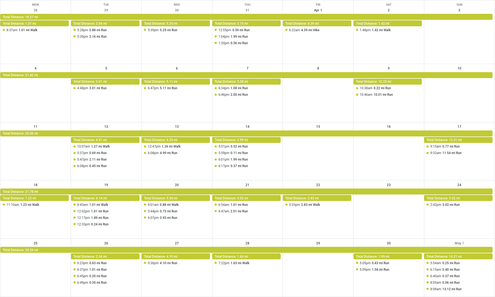

# Active Calendar
Active Calendar aims to help runners and cyclists keep track of their daily activities in a way that is easy to digest at a quick glance.

Even on a training plan, keeping track of your daily and weekly millage, pace, and effort can be difficult to do at a quick glance. How many activities did you do last week? What was the total millage? With Active Calendar you can easily view all these details by simply glancing at your calendar!

## Calendar View

## Activity View

## Summary View (Daily and Weekly Summaries)

# Future Features
- [ ] Provide Fitness, Fatigue, and Form (CTL, ATL, TSB) metrics for each activity.
- [ ] Publish activity and summary templates to individual Google Calendars so users can switch between the summary and activity views.

# Other
This application was heavily inspired by the [full-stack-fastapi-postgresql template](https://github.com/tiangolo/full-stack-fastapi-postgresql).
